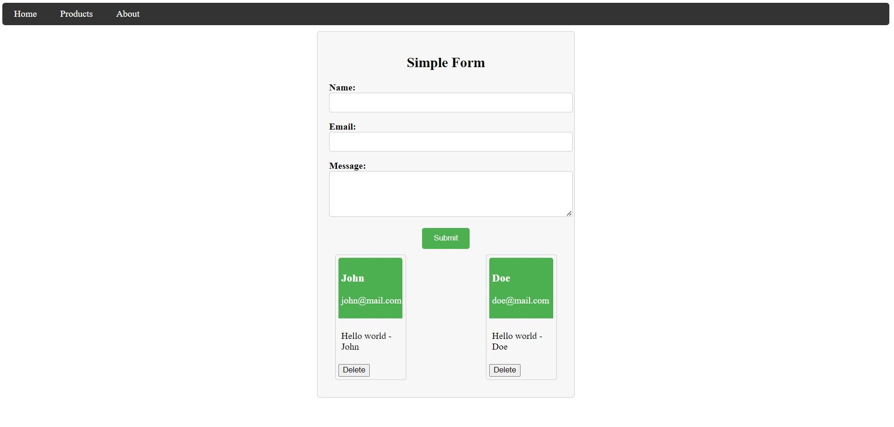
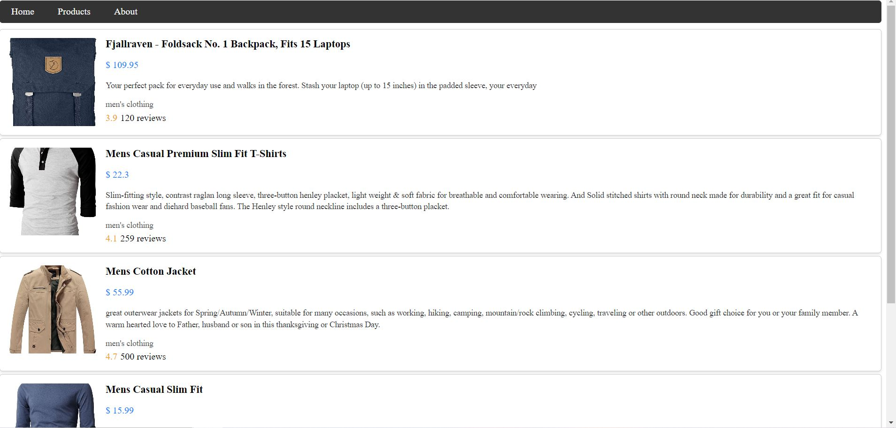

# Angular First Step

This project is a part of my learning process in Angular, where I've focused on understanding and implementing fundamental concepts such as components, services, routing, and HTTP communication.

## Table of Contents

- [Part 1: Form](#part-1-form)
- [Part 2: Routing and Fake Store](#part-2-routing-and-fake-store)
- [Screenshots](#screenshots)
- [Notes](#notes)

## Part 1: Form

This part of the project is designed to help me practice working with forms in Angular.

## Part 2: Routing and Fake Store

In this section, I've implemented routing functionality to navigate between different views. Additionally, I've utilized the Angular HTTP client to communicate with a fake API and create a simple fake store.

## Screenshots

Demo picture of the form.

Demo picture of the store

## Notes

This project was created as a part of my Angular learning journey. Feel free to explore the code, make changes, and provide feedback.

---

*This README.md was mostly written with the help of [ChatGPT](https://www.openai.com/).* 
